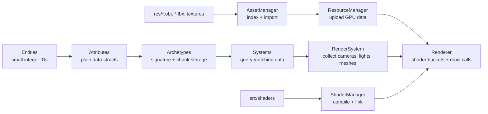

# Sable


Sable is a C++23 game engine prototype built around a compact, data-oriented ECS and a modern OpenGL renderer. It is designed for games that benefit from predictable data layout, explicit systems, and a clean separation between gameplay data, asset loading, and GPU resources.

The games in this repository are examples. They are useful because they prove the engine loop, but they are not the center of the project. The center of Sable is the engine core: small entity IDs, archetype-based attribute storage, fast signature matching, reusable systems, shader-managed rendering, and a simple path from model files to GPU draw calls.

`Trains` is the current showcase project. It demonstrates generated terrain, rail routing, resource pickup and delivery, multiple camera passes, and a minimap rendered through a texture camera.

## Table of Contents

- [Why Sable](#why-sable)
- [Highlights](#highlights)
- [Architecture](#architecture)
- [Repository Layout](#repository-layout)
- [Requirements](#requirements)
- [Build and Run](#build-and-run)
- [Core Concepts](#core-concepts)
- [Quick Start](#quick-start)
- [Creating Gameplay](#creating-gameplay)
- [Adding a New Project](#adding-a-new-project)
- [Example Project: Trains](#example-project-trains)
- [Performance Model](#performance-model)
- [Troubleshooting](#troubleshooting)
- [Current Scope](#current-scope)
- [Roadmap](#roadmap)
- [License](#license)

## Why Sable

Many small engines begin as object hierarchies: a game object owns components, components own behavior, and update loops spend more and more time jumping through scattered memory. Sable takes the opposite route.

Entities are lightweight IDs. Attributes are plain data. Systems own behavior. Entities with the same attribute shape are grouped into archetypes, and archetypes store their data in fixed-size chunks. That gives the engine a direct way to answer the most important runtime question: "Which entities have the data this system needs?"

The result is an engine that is easy to reason about and naturally friendly to performance work:

- Gameplay code can be written as small, focused systems.
- Data access patterns are explicit.
- Rendering works from uploaded GPU resources instead of repeatedly rebuilding asset state.
- Project-specific gameplay can live outside the reusable engine core.

## Highlights

- **Data-oriented ECS** with entity IDs, registered attribute types, bitset signatures, and archetype storage.
- **Chunked archetype memory** with 16 KB chunks and contiguous per-entity attribute blocks.
- **System priorities** for predictable update order, including pre-physics, physics, pre-render, render, and post-render phases.
- **Modern OpenGL renderer** using GLAD, GLFW, VAOs, VBOs, EBOs, textures, shader programs, and shader-storage buffers for lights.
- **Shader-grouped draw submission** to reduce unnecessary OpenGL program switches.
- **Asset pipeline** that indexes models under `res`, imports them through Assimp, loads textures through stb_image, and uploads render data through `ResourceManager`.
- **Camera scopes** for scene rendering, UI rendering, and render-to-texture workflows.
- **Project modules** so games can add their own attributes, systems, managers, and executable entry points without rewriting the engine.

## Architecture

Sable is split into reusable engine code under [`src/core`](src/core) and example/game code under [`src/projects`](src/projects).



### Engine Layers

| Layer | Path | Responsibility |
| --- | --- | --- |
| ECS | [`src/core/ecs`](src/core/ecs) | Entities, attribute registration, archetypes, signatures, system scheduling |
| Attributes | [`src/core/attributes`](src/core/attributes) | Reusable engine data such as transforms, cameras, meshes, lights, follow targets |
| Systems | [`src/core/systems`](src/core/systems) | Built-in behavior for cameras, rendering, and following entities |
| Rendering | [`src/core/render`](src/core/render) | Drawables, render-model data, material data, light buffers, draw submission |
| Managers | [`src/core/managers`](src/core/managers) | Assets, GPU resources, shaders, input, scene state |
| Platform | [`src/core/platform`](src/core/platform) | GLFW window and GLAD OpenGL initialization |
| Time | [`src/core/time`](src/core/time) | Frame delta time |
| Projects | [`src/projects`](src/projects) | Game-specific attributes, systems, managers, and app targets |

## Repository Layout

```text
Sable2/
  CMakeLists.txt
  README.md
  res/
    Buildings/
    Rails/
    Resources/
    Tiles/
    Train/
  src/
    app/                     # Legacy/simple app target
    core/
      attributes/
      assetloader/
      ecs/
      graphics/
      managers/
      platform/
      render/
      systems/
      time/
    projects/
      Trains/
        app/
        attributes/
        managers/
        systems/
        types/
    shaders/
      default/
      minimap/
  lib/
    assimp-5.0.1/
    glad/
    glfw-3.3.4/
    glm-0.9.9.8/
    stb-image/
```

## Requirements

- CMake 3.10 or newer
- A C++23-capable compiler
- OpenGL 4.6 core profile
- `GL_ARB_direct_state_access` support
- A GPU driver capable of creating the required OpenGL context

The main third-party dependencies are vendored in [`lib`](lib):

| Dependency | Used For |
| --- | --- |
| GLFW | Window creation and input |
| GLAD | OpenGL function loading |
| GLM | Math types and transforms |
| Assimp | Model import |
| stb_image | Texture loading |

## Build and Run

Use a fresh build directory when switching machines, generators, or compiler toolchains. CMake caches absolute paths, so an old build directory can point at a previous local setup.

### Configure

Single-config generator, for example Ninja:

```powershell
cmake -S . -B build/local -G Ninja -DCMAKE_BUILD_TYPE=Release
```

Visual Studio generator:

```powershell
cmake -S . -B build/vs -G "Visual Studio 17 2022"
```

Default generator:

```powershell
cmake -S . -B build/local
```

### Build the Trains Example

Single-config generator:

```powershell
cmake --build build/local --target trains
```

Multi-config generator:

```powershell
cmake --build build/vs --target trains --config Debug
```

### Run

The `trains` target writes its executable under the build tree, usually near:

```text
build/local/bin/trains/trains.exe
```

For multi-config generators, the exact path can include the configuration name, such as `Debug` or `Release`.

## Core Concepts

### Entities

An entity is a small ID managed by `ECSManager`.

```cpp
core::ecs::ECSManager& ecs = core::ecs::ECSManager::GetInstance();
core::ecs::Entity entity = ecs.CreateEntity();
```

The current engine type is `uint16_t`, which keeps handles compact and allows dense lookup tables.

### Attributes

Attributes are plain data structs derived from `core::ecs::IAttribute`.

```cpp
struct Velocity : core::ecs::IAttribute {
    glm::vec3 value = glm::vec3(0.0f);
};
```

Every attribute type must be registered before it is attached to an entity:

```cpp
ecs.RegisterAttribute<Velocity>();
```

### Archetypes

An archetype represents one exact combination of attributes. For example:

```text
Transform + StaticMesh
Transform + Camera
Transform + Light
Transform + Train + BoxCollider
```

Systems query archetypes by signature. A system asking for `Transform + StaticMesh` can process every entity that has at least those attributes.

### Systems

Systems contain behavior. They are registered with the attributes they need and an optional priority:

```cpp
ecs.RegisterSystem<
    MovementSystem,
    core::attributes::Transform,
    Velocity
>(core::ecs::SystemPriority::kPrePhysics);
```

System priorities are defined in [`src/core/ecs/system_manager.h`](src/core/ecs/system_manager.h):

| Priority | Purpose |
| --- | --- |
| `kPrePhysics` | Input, control, pre-simulation movement |
| `kPhisics` | Physics or collision work |
| `kPostPhysics` | Cleanup after physics |
| `kPreRender` | Camera updates and render preparation |
| `kRender` | Draw submission |
| `kPostRender` | Post-render work |
| `kDefaultPriority` | General systems |

Note: `kPhisics` is the current enum spelling in code.

### Assets and Resources

Sable separates CPU-side assets from GPU-side render resources.

```cpp
auto& assets = core::managers::AssetManager::GetInstance();
auto& resources = core::managers::ResourceManager::GetInstance();

core::managers::ModelID model_id =
    assets.LoadModel("Train/train_locomotive/train_locomotive.obj").value();

resources.UploadModel(model_id);
```

`AssetManager` works with paths relative to [`res`](res). `ResourceManager` turns loaded model data into render data such as VAOs, buffers, textures, and material handles.

### Cameras and Render Passes

The `Camera` attribute supports three scopes:

| Scope | Use |
| --- | --- |
| `kScene` | Main world rendering |
| `kUI` | Overlay and interface rendering |
| `kTexture` | Render-to-texture passes such as minimaps |

Renderable attributes and cameras use culling masks. A camera only sees renderables whose mask overlaps its own mask.

## Quick Start

This is the normal shape of a Sable application.

### 1. Create a Window

```cpp
#include "core/platform/window.h"

Window window(2000, 1200, "Sable");
```

The window wrapper initializes GLFW, creates an OpenGL 4.6 core profile context, and loads GL functions through GLAD.

### 2. Register Engine Attributes

```cpp
#include "core/ecs/ecs_manager.h"
#include "core/attributes/transform.h"
#include "core/attributes/camera.h"
#include "core/attributes/static_mesh.h"
#include "core/attributes/light.h"

auto& ecs = core::ecs::ECSManager::GetInstance();

ecs.RegisterAttribute<core::attributes::Transform>();
ecs.RegisterAttribute<core::attributes::Camera>();
ecs.RegisterAttribute<core::attributes::StaticMesh>();
ecs.RegisterAttribute<core::attributes::Light>();
```

### 3. Register Engine Systems

```cpp
#include "core/systems/camera_system.h"
#include "core/systems/render_system.h"

ecs.RegisterSystem<
    core::systems::CameraSystem,
    core::attributes::Transform,
    core::attributes::Camera
>(core::ecs::SystemPriority::kPreRender);

ecs.RegisterSystem<
    core::systems::RenderSystem,
    core::attributes::Transform,
    core::attributes::StaticMesh,
    core::attributes::Camera,
    core::attributes::Light
>(core::ecs::SystemPriority::kRender);
```

### 4. Load a Model

```cpp
#include "core/managers/asset_manager.h"
#include "core/managers/resource_manager.h"

auto& asset_manager = core::managers::AssetManager::GetInstance();
auto& resource_manager = core::managers::ResourceManager::GetInstance();

core::managers::ModelID locomotive =
    asset_manager.LoadModel("Train/train_locomotive/train_locomotive.obj").value();

resource_manager.UploadModel(locomotive);
```

### 5. Create a Renderable Entity

```cpp
core::ecs::Entity train = ecs.CreateEntity();

core::attributes::Transform transform;
transform.position = glm::vec3(0.0f, 7.0f, 0.0f);
transform.scale = glm::vec3(10.0f);
ecs.AddAttribute<core::attributes::Transform>(train.id, transform);

core::attributes::StaticMesh mesh;
mesh.model_id = locomotive;
mesh.culling_mask = 0x00000001;
ecs.AddAttribute<core::attributes::StaticMesh>(train.id, mesh);
```

### 6. Create a Camera

```cpp
core::ecs::Entity camera_entity = ecs.CreateEntity();

core::attributes::Transform camera_transform;
camera_transform.position = glm::vec3(0.0f, 700.0f, 0.0f);
camera_transform.rotation = glm::vec3(-90.0f, 0.0f, 0.0f);
ecs.AddAttribute<core::attributes::Transform>(camera_entity.id, camera_transform);

core::attributes::Camera camera;
camera.width = 2000;
camera.height = 1200;
camera.type = core::attributes::CameraType::kPerspective;
camera.scope = core::attributes::CameraScope::kScene;
camera.culling_mask = 0x00000001;
ecs.AddAttribute<core::attributes::Camera>(camera_entity.id, camera);
```

### 7. Start and Tick Systems

```cpp
#include "core/time/apptime.h"

ecs.StartSystems();
Time::GetInstance().Init(glfwGetTime());

while (!glfwWindowShouldClose(window.GetInstance())) {
    Time::GetInstance().ComputeDeltaTime(glfwGetTime());

    ecs.UpdateSystems(static_cast<float>(Time::GetInstance().GetDeltaTime()));

    glfwSwapBuffers(window.GetInstance());
    glfwPollEvents();
}
```

## Creating Gameplay

A gameplay feature usually has one or more attributes plus a system that processes matching entities.

### Define an Attribute

```cpp
#include "core/ecs/types.h"

struct Velocity : core::ecs::IAttribute {
    glm::vec3 value = glm::vec3(0.0f);
};
```

### Define a System

```cpp
#include "core/ecs/system.h"
#include "core/attributes/transform.h"

class MovementSystem : public core::ecs::ISystem {
public:
    void Start() override {}
    void StartAllArchetypes() override {}
    void Tick(float delta_time) override {}

    void TickAllArchetypes(float delta_time) override {
        auto archetypes = archetype_manager_.QueryArchetypes(
            ecs_manager_.GetSignatureFor<
                core::attributes::Transform,
                Velocity
            >()
        );

        for (auto& archetype_ref : archetypes) {
            core::ecs::Archetype& archetype = archetype_ref.get();
            archetype.ForEach([this, delta_time](core::ecs::EntityID id, size_t) {
                auto& transform = ecs_manager_.GetAttribute<core::attributes::Transform>(id);
                auto& velocity = ecs_manager_.GetAttribute<Velocity>(id);

                transform.position += velocity.value * delta_time;
            });
        }
    }
};
```

### Register the Feature

```cpp
ecs.RegisterAttribute<Velocity>();

ecs.RegisterSystem<
    MovementSystem,
    core::attributes::Transform,
    Velocity
>(core::ecs::SystemPriority::kPrePhysics);
```

### Attach the Attribute to an Entity

```cpp
Velocity velocity;
velocity.value = glm::vec3(0.0f, 0.0f, 4.0f);
ecs.AddAttribute<Velocity>(entity.id, velocity);
```

## Adding a New Project

Projects live under `src/projects`. A typical game module can mirror the `Trains` structure:

```text
src/projects/MyGame/
  CMakeLists.txt
  app/
    CMakeLists.txt
    my_game.cpp
  attributes/
    CMakeLists.txt
    player.h
  systems/
    CMakeLists.txt
    player_system.h
    player_system.cpp
  managers/
    CMakeLists.txt
```

Add the project directory to [`src/projects/CMakeLists.txt`](src/projects/CMakeLists.txt):

```cmake
add_subdirectory(MyGame)
```

Link your executable against the engine libraries it needs:

```cmake
add_executable(my_game
    my_game.cpp
)

target_link_libraries(my_game PRIVATE
    ecs
    render
    systems
    platform
    attributes
    assetloader
    managers
    time
    graphics
)
```

Keep reusable engine features in `src/core`. Keep game-specific rules, managers, and attributes inside your project folder.

## Example Project: Trains

[`src/projects/Trains`](src/projects/Trains) is an example game module built on top of Sable.

It demonstrates:

- A generated hex map with tiles, rivers, rails, resources, and buildings.
- A rail graph used by trains to choose routes.
- Project-specific attributes such as `Train`, `Bank`, `ResourceGenerator`, and `BoxCollider`.
- Project-specific systems such as `TrainSystem`, `BankSystem`, `ResourceSystem`, and `CollisionSystem`.
- A main scene camera that follows the train.
- A render-to-texture minimap camera.
- A UI camera that draws the minimap plane.
- Resource pickup, wagon creation, delivery, and simple collision behavior.

The important lesson is not "Sable is a train game." The important lesson is that a game can add domain-specific gameplay while the engine continues to provide the ECS, rendering, asset, shader, input, and timing foundation.

## Performance Model

| Design Choice | Why It Matters |
| --- | --- |
| `uint16_t` entity IDs | Compact handles and dense arrays for entity signatures |
| `uint8_t` attribute type IDs | Small identifiers for registered attribute kinds |
| `std::bitset<64>` archetype signatures | Fast matching with bitset containment checks |
| 16 KB archetype chunks | Predictable allocation units and cache-friendly iteration |
| Contiguous attribute blocks | Data needed by one entity is stored together inside its archetype |
| Swap-remove entity deletion | Keeps archetype storage dense after removals |
| Asset upload step | Prevents repeated model-to-GPU conversion during normal frames |
| Shader-bucketed draw calls | Reduces redundant shader program switches |
| Camera culling masks | Makes multi-pass rendering explicit and cheap to filter |

## Troubleshooting

### CMake says the build directory belongs to another path

Create a fresh build directory:

```powershell
cmake -S . -B build/local
```

Avoid reusing a `build` folder copied from another machine or from a different checkout path.

### Visual Studio generator cannot find an installed instance

Use a generator installed on your machine, or install the Visual Studio C++ build tools. You can list CMake generators with:

```powershell
cmake --help
```

### The window fails to initialize OpenGL

Sable requests an OpenGL 4.6 core profile and requires `GL_ARB_direct_state_access`. Update GPU drivers or run on hardware that supports those features.

### A model path is not found

Model paths passed to `AssetManager::LoadModel` are relative to [`res`](res) and should use forward slashes:

```cpp
asset_manager.LoadModel("Train/train_locomotive/train_locomotive.obj");
```

### A shader path is not found

Shader paths passed to `ShaderManager::GetShaderFromPath` are relative to [`src/shaders`](src/shaders):

```cpp
shader_manager.GetShaderFromPath("minimap/minimap.vert");
```

### Assimp takes a long time to build

Assimp is vendored and compiled as part of the project. The first build can take noticeably longer than later incremental builds.

## Current Scope

Sable is an engine prototype. It currently focuses on:

- ECS architecture
- Static mesh rendering
- OBJ and FBX asset indexing through `AssetManager`
- Assimp-backed model import
- Texture loading
- Shader compilation and program linking
- Scene, UI, and texture camera passes
- Simple input polling
- Frame delta timing
- Project-level gameplay modules

Current limitations:

- No editor.
- No scripting layer.
- No animation system.
- No physics engine in `core`.
- No automated test suite yet.
- Perspective camera aspect ratio is currently fixed in the camera system.
- Input mappings are currently hard-coded in `InputManager`.
- The Trains collision layer is example-level brute-force AABB logic, not a reusable engine physics world.

## Roadmap

Useful next steps for the engine:

- Add focused tests for ECS storage, attribute moves, and system matching.
- Add component lifecycle handling for non-trivial attribute types.
- Cache system archetype queries directly in system update paths.
- Add render statistics and profiling hooks.
- Improve shader program caching.
- Add a reusable collision or physics module.
- Add animation support.
- Add configurable input bindings.
- Add sample screenshots or capture clips to the README.
- Add documentation pages for each core subsystem.

## License

No license file is currently included in this repository. Add a `LICENSE` file before publishing the project for reuse or distribution.
